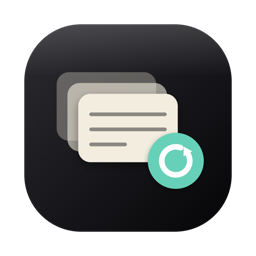
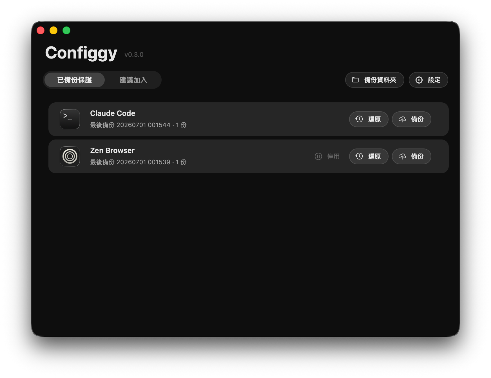
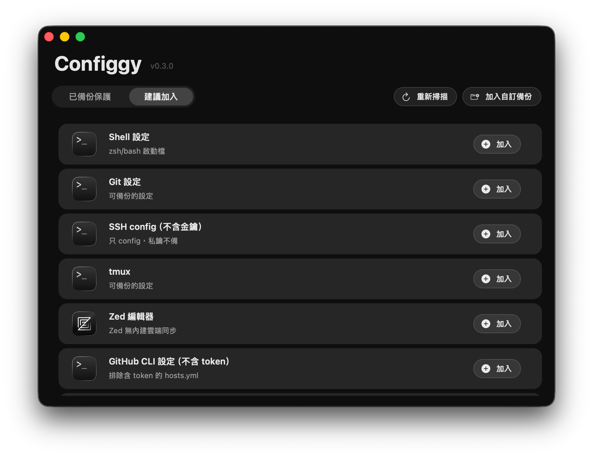
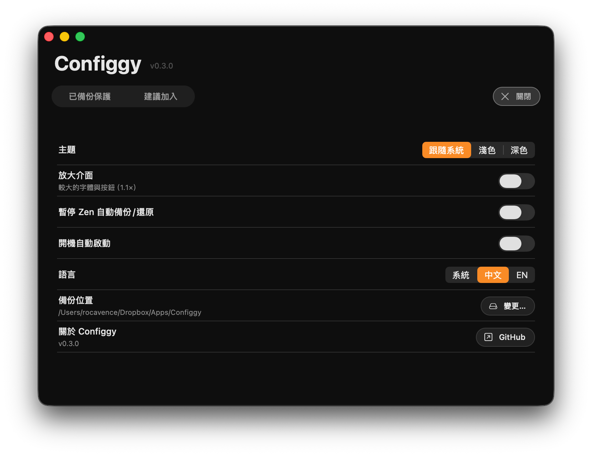
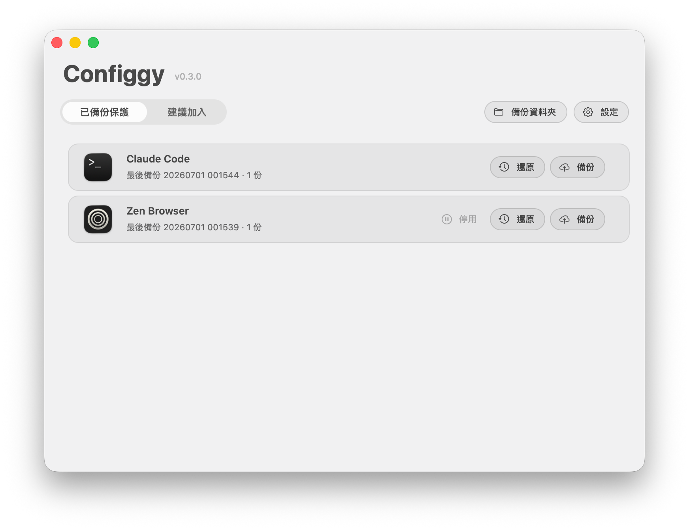

<p align="center">
  
</p>

<h1 align="center">Configgy</h1>

<p align="center">
  A macOS app that backs up &amp; restores your local config across devices —
  <b>Zen Browser</b>, <b>Claude Code</b>, and any folder you point it at.
</p>

<p align="center">
  Native Swift (AppKit) · menubar agent + a single management window · no dependencies ·
  backups land in <code>Dropbox / iCloud / Google&nbsp;Drive / a folder</code> under <code>…/Configgy/</code>
</p>

<p align="center"><a href="https://configgy.rocavence.com">configgy.rocavence.com</a></p>

<p align="center"><b>English</b> · <a href="README.zh-Hant.md">繁體中文</a></p>

---

## What it does

Configgy keeps the *settings* that are painful to lose — but that you don't want in a
blanket cloud sync — versioned, portable, and one click away. It runs as a menubar
agent; everything you do lives in one window.

| Target | Mechanism | Trigger |
|---|---|---|
| **Zen Browser** | versioned `.zip` snapshots (keeps 10, deduped); each zip self-restores via an embedded `restore.sh` | auto on Zen quit |
| **Claude Code** | versioned `.zip` snapshots of `~/.claude` (+ `~/.agents/skills`); restore reinstalls plugins | manual |
| **Custom / discovered** | versioned, absolute-path-preserving `.zip` snapshots | manual |

> **No secrets.** Passwords, cookies, history, SSH private keys, and the token-bearing
> `gh hosts.yml` are never copied — those come back via your Mozilla account / Keychain.

### The window

A single window with a capsule tab switching two lists:

- **已備份保護 / Protected** — your active targets (Claude, Zen if enabled, custom). Each
  row: app icon, name, *last backup · N snapshots*, and **Back Up** / **Restore** /
  **Remove** as compact pill buttons that tint on hover (green / orange / red).
- **建議加入 / Suggestions** — Zen, plus configs discovered on this Mac that have no cloud
  sync of their own (shell dotfiles, git, `~/.ssh/config`, Zed, VS Code, terminals,
  Karabiner, Hammerspoon, gh, and menubar utilities like MonitorControl / Moom / IINA).
  Tap **Add** to start versioning one.

A **gear → Settings** page (in-window, with an ✕ to close) holds: **Theme**
(System / Light / Dark), **Enlarge UI** (1.1×), **Launch at Login**, **Backup Location**,
and **About**. The menubar itself is just *Open Configgy*, *About*, *Quit* (plus an FDA
warning when needed).

### Touches

- **Live feel** — hover highlights a row; a backup runs a green flowing-light progress
  bar then the button flashes "✓ Backed up"; restore is orange; removing a target
  crumbles its row. Light/dark are both first-class (Finder-like light palette).
- **Preview before restore** — restores show which files would change and confirm first;
  old files are backed up before being overwritten.
- **Re-adopt on open** — Configgy scans the backup folder on launch, so targets already
  backed up (e.g. on another Mac) reappear ready to restore.
- **Zen is careful** — backing up Zen offers *Cancel · Back up on quit · Back up now*,
  and "Back up now" confirms again before quitting your browser.

### Screenshots

<table>
  <tr>
    <td width="50%"></td>
    <td width="50%"></td>
  </tr>
  <tr>
    <td><sub><b>Protected</b> — your active targets. Each row shows the app icon, <i>last backup · N snapshots</i>, and inline <b>Restore</b> / <b>Back Up</b>; Zen also carries its pause badge.</sub></td>
    <td><sub><b>Suggestions</b> — sync-less configs found on this Mac (shell, git, SSH config without keys, tmux, Zed, gh without its token). Tap <b>Add</b> to start versioning one.</sub></td>
  </tr>
  <tr>
    <td width="50%"></td>
    <td width="50%"></td>
  </tr>
  <tr>
    <td><sub><b>Settings</b> — in-window, not a deep menu: Theme, Enlarge UI, pause Zen, Launch at Login, language, backup location, About.</sub></td>
    <td><sub><b>Light mode</b> — the same window in the appearance-aware, Finder-like light palette; colours re-resolve when the system appearance flips.</sub></td>
  </tr>
</table>

## Install

1. Download the `.dmg` from [Releases](https://github.com/rocavence/Configgy-app/releases),
   drag **Configgy** to Applications.
2. Self-signed personal tool → Gatekeeper warns; **right-click → Open** the first time.
3. **Grant Full Disk Access** (the app guides you on first launch) so it can reach the
   backup folder. macOS never prompts for this automatically.
4. Pick a **backup location** — Dropbox by default; if none is found you choose Dropbox /
   iCloud Drive / Google Drive / a custom folder.

## Build from source

Requires Xcode Command Line Tools (`swift`, `codesign`); no full Xcode.

```sh
sh Scripts/build-app.sh           # → build/Configgy.app
cp -R build/Configgy.app /Applications/
```

The build signs with a stable self-signed identity (`Configgy` / `Findly Self-Signed`) so
Full Disk Access survives rebuilds.

## CLI

The same binary runs headless:

```
Configgy backup [--force] | list | status | preview <zip>
Configgy restore [<zip> [ws <uuid…>]] | workspaces <zip>
Configgy claude-backup | claude-list | claude-restore [<zip>] | claude-preview <zip>
Configgy discover | targets | locations | target-add <id> <name> <path…>
Configgy target-backup <id> | target-list <id> | target-restore <id> [<zip>] | target-preview <id> [<zip>]
```

---

## Design &amp; development notes

Configgy started life as **Zennly**, a one-trick menubar app that zipped the Zen Browser
profile to Dropbox on quit and offered a cross-device restore. It grew from there:

- **From one app to a model.** Claude Code config joined as a second target, then the idea
  generalized: a *target* is just "a set of paths, versioned as dated zips, with history,
  diff-preview, and additive restore." Zen and the generic targets share that contract;
  Claude is the same shape with a plugin-reinstall step. Zip snapshots beat a single
  rsync mirror because you get rollback for free, and per-host filenames avoid
  cross-machine conflicts.
- **Safe by default.** Discovery only suggests sync-less config and deliberately excludes
  secrets (SSH keys, `gh` tokens). Restores preview their diff and pre-back-up whatever
  they overwrite. Destructive actions confirm — and Zen never closes your browser without
  a second yes.
- **Opt-in, not assumed.** Out of the box only Claude is on; Zen and everything else is a
  suggestion you adopt. The app also launches fine on Macs without Zen.
- **The UI was iterated hard.** It converged on a single Mole-inspired window: one list,
  inline actions, an in-window settings page instead of a deep menubar. The visual pass
  drew on the `ui-ux-pro` and `frontend-design` skills — an 8-pt rhythm, clustered
  right-aligned actions, custom pill buttons with controlled padding (AppKit's bezel
  metrics don't scale cleanly), hover-only semantic colour, and a de-emphasised
  destructive action. A real gotcha shaped the palette: the first build used white-alpha
  overlays that were invisible in Light mode, so colours are now appearance-aware
  (lighten on dark, darken on light) and re-resolve on appearance change.
- **macOS sharp edges met along the way.** `NSStatusItem` ignores menu reassignment from
  inside a menu action (so the menu is repopulated in `menuNeedsUpdate`); a window's close
  *animation* can crash if released mid-transaction (so zoom rebuilds defer + `orderOut`);
  Full Disk Access never prompts (so there's a guided onboarding); overlay scrollers clip
  a row's corner (so rows reserve a right gutter).
- **Built almost entirely through conversation** with Claude Code (Opus) — each change was
  compiled, installed, and committed in a tight loop; the UI was tuned from screenshots.

<sub>Licensed under <a href="LICENSE">CC BY-NC-SA 4.0</a> · a personal tool, shared as-is — no warranty · built with Claude Code.</sub>
